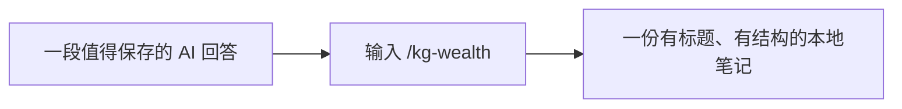

# my-pi

## 让每一次 AI 对话，都成为下一次做事的起点。

有些回答，值得留下来。<br>
有些想法，值得先想清楚。<br>
有些事情，需要聊很多轮，才能真正向前一步。

**my-pi 是我为自己整理的一套 [pi](https://pi.dev/) 使用配置：让 AI 不只回答问题，还能帮你理清思路、推进事情、留下积累。**

[看看能做什么](#what-you-get) · [体验一次知识沉淀](#try-it) · [开始使用](#getting-started)

---

<a id="what-you-get"></a>

## 你是不是也遇到过这些情况？

- 和 AI 聊出一个好办法，过几天却找不到了。
- AI 很快给出方案，但你真正的需求还没说清楚。
- 一件事情聊了很久，接着做时又得重新解释背景。
- 收集了很多回答，却很少变成以后能用得上的东西。

my-pi 想改善的，就是这些对话与行动之间的小断点。

| 你想要的 | my-pi 帮你做的 |
| --- | --- |
| **好回答留下来** | 把有价值的回答整理为本地知识笔记 |
| **想清楚再开始** | 通过提问、梳理和评审，把开发想法变成方案 |
| **长任务接着做** | 保留关键记录，在长对话中提供恢复线索 |

## 把好回答，变成自己的积累

你刚和 AI 理清一个概念、比较几个选项，或者解决一个问题。觉得这段内容值得保存？输入：

```text
/kg-wealth
```

它会取出上一条有效回答，交由 AI 重新整理并写入本地知识目录。

留下来的可以是一个终于理解清楚的知识点、一次选择背后的判断依据，也可以是一套操作方法、一段排障经验，或一份调研的结论与不确定性。

**不用每次重新复制、排版、起标题。让值得留下的内容，变成以后更容易找到、看懂和复用的笔记。**

### 从一次交流，到一份自己的参考

> 你问：“我应该把资料存在云盘，还是本地硬盘？”

交流结束后，输入 `/kg-wealth`：



| 对话中的回答 | 整理后的笔记 |
| --- | --- |
| 对云盘和本地硬盘的分析与建议 | **《个人资料存储方式的选择依据》** |
| 分散在回答中的比较和提醒 | 适用场景、选择因素、建议及成立条件、待确认信息 |

以后再遇到类似问题，就有了一份自己的参考。

*以上为使用示意，不是运行截图。实际笔记根据上一条回答整理，默认保存到 `~/Documents/wealth/knowledge`，格式为 Markdown。整理与写入由当前 AI 完成，请核对生成内容与保存结果。*

## 把模糊想法，聊成清晰方案

有时候，你需要的不是立刻动手，而是先把事情说清楚。

> “我想给现有系统增加一个导出功能，但还没想好具体怎么做。”

使用 `/dev-plan` 后，工作流会围绕已有项目探索背景、提出关键问题、整理方案，再进行独立评审。

```text
一个想法 → 澄清关键问题 → 形成方案 → 独立评审 → 交给你确认
```

**先弄清楚做什么、为什么做、怎样算做好，再决定是否开始开发。**

此功能面向开发项目，需要额外的社区组件与配置；只交付方案，不会自动编码。[查看使用指南](./handbook/subagents/dev-plan-workflow.md)。

## 让长任务，多一些连续性

复杂的事情，往往不止聊一轮。

my-pi 会记录关键事件，并在对话过长、系统压缩上下文后提供恢复线索，帮助 AI 接着理解之前的工作。

它也引导 AI 从大量日志和工具结果中提取需要的信息，让有限的对话空间更多地留给当前问题。

**少一些重复交代，多一些接着往下做。**

这些机制用于改善连续性，不代表 AI 能永久记住所有内容。

---

<a id="try-it"></a>

## 从一个小习惯开始

你不需要一次用上全部功能。安装后，可以先试一个动作：

1. 和 pi 讨论一个你最近真正关心的问题。
2. 等它给出一段值得保存的回答。
3. 输入 `/kg-wealth`，等待整理与写入完成。
4. 打开回复中给出的文件路径，看看这条笔记是否值得长期保留。

**先留下一条真正有用的笔记，再慢慢建立适合自己的 AI 工作方式。**

<a id="getting-started"></a>

## 开始使用

**适合你，如果你已经在使用 pi，希望把交流、任务推进和知识积累连接起来。**

my-pi 是运行在 pi 中的配置包，不是独立的网页应用。安装需要使用终端；请先安装 [pi](https://pi.dev/)，配置可用的模型，并确认能够正常对话。

### 安装

在终端执行：

```bash
pi install git:github.com/LicsDaSheng/my-pi
```

重新启动 pi，或在已有会话中使用 `/reload` 重新加载，然后尝试 `/kg-wealth`。

### 更新

```bash
pi update --extensions
```

更新后重新启动 pi，或使用 `/reload`。Git 安装读取的是仓库中可更新的版本：仅修改本地源码、仅执行 `/reload`，都不会把另一源码工作区的改动同步到已安装副本。

### 哪些可以直接用？

- **本包内置**：知识沉淀、上下文管理、限流重试，以及下方列出的技能与提示词。
- **需要额外配置**：`/dev-plan` 依赖 `pi-subagents` 和结构化问卷组件，还需要配置参与角色的模型。请先按[工作流指南](./handbook/subagents/dev-plan-workflow.md)完成配置。
- **按需搭配**：下方社区组件单独安装，本包不会替你安装或配置它们。

`/kg-wealth` 会向当前模型提交一次新任务，需要可用的文件写入工具及目标目录权限；相关模型调用按你所用服务计费。

---

## 按需探索

以下是命令、组件与自定义入口。第一次使用，可以先从 `/kg-wealth` 开始。

### 功能与命令速查

| 入口 | 用途 | 来源 |
| --- | --- | --- |
| `/kg-wealth` | 将当前活动分支的最近有效回答整理为知识笔记 | 内置扩展 |
| `/ctx-stats`、`/ctx-doctor` | 查看上下文记录统计、检查运行状态 | 内置扩展 |
| `ctx_search` | 供 AI 检索已记录的会话事件 | 内置工具，由 AI 调用 |
| `/dev-plan <需求>` | 探索、访谈、设计、独立评审与方案交付 | 内置提示词，需社区配套 |
| `/gmz`、`/gme` | 分析暂存改动并执行中文或英文 Git 提交 | 内置提示词 |

Git 提交提示词要求先确认未暂存改动的处理方式；请在执行前核对提交范围。

### 内置扩展

- [kg-wealth](./extensions/kg-wealth/)：知识沉淀，支持做事、知识、决策、经验、调研与复盘六类片段。固定整理提示词位于 [prompt.ts](./extensions/kg-wealth/prompt.ts)。
- [context-mode](./extensions/context-mode/)：用 SQLite（含 FTS5）记录事件、在压缩前生成恢复快照，并引导大输出先落盘再按需读取；拦截 bash 中的内联 HTTP 客户端调用。依赖原生模块 `better-sqlite3`。
- [llm-retry](./extensions/llm-retry/)：识别可重试的限流错误，在任务结束且空闲后等待 3 秒，重试上一条用户消息一次。

### 内置技能

| 技能 | 适用场景 |
| --- | --- |
| [deep-think](./skills/deep-think/SKILL.md) | 沿一个问题深入追问，梳理本质 |
| [context-mode](./skills/context-mode/SKILL.md) | 处理大量日志、数据与工具输出时节省上下文 |
| [tdd-workflow](./skills/tdd-workflow/SKILL.md) | 用测试驱动功能开发、缺陷修复与重构 |
| [gitlab-mr-flow](./skills/gitlab-mr-flow/SKILL.md) | 串起 GitLab Issue、分支、提交与 MR 流程 |
| [no-negative-echo](./skills/no-negative-echo/SKILL.md) | 让最终交付聚焦已接受的结果 |

### 推荐搭配的社区组件

| 组件 | 可以补充什么 |
| --- | --- |
| [pi-subagents](https://pi.dev/packages/pi-subagents?name=pi-subagents) | 多个 AI 角色分工协作与独立评审；`/dev-plan` 所需 |
| [rpiv-ask-user-question](https://pi.dev/packages/@juicesharp/rpiv-ask-user-question?name=rpiv-ask-user-question) | 用结构化问卷澄清需求；`/dev-plan` 所需 |
| [pi-memory](https://pi.dev/packages/pi-memory?name=pi-memory) | 日常日志、长期记忆与便签，支持基于 QMD 的语义检索 |
| [pi-goal](https://pi.dev/packages/@narumitw/pi-goal?name=%40narumitw%2Fpi-goal) | 通过 `/goal` 围绕目标持续推进任务 |
| [pi-mcp-adapter](https://pi.dev/packages/pi-mcp-adapter?name=pi-mcp-adapter) | 连接 MCP 工具与服务 |

### 使用指南

- [/dev-plan 开发方案工作流](./handbook/subagents/dev-plan-workflow.md)：使用前提、访谈、评审与交付边界。
- [pi-subagents 配置指南](./handbook/subagents/pi-subagents-config.md)：字段含义、使用场景与配置建议。
- [子代理手册索引](./handbook/subagents/README.md)：按需查阅配套说明。

### 自定义与开发

想把这套配置调整成自己的习惯？可以从修改知识沉淀提示词，或增加一个常用提示词开始。

在本地源码目录中：

```bash
# 安装依赖
npm install

# 运行测试与类型检查
npm test
npm run typecheck

# 临时加载一个扩展进行体验
pi -e ./extensions/kg-wealth/index.ts

# 或安装整个本地包
pi install ./
```

本地加载的文件修改后，在 pi 中使用 `/reload`。请避免同时加载同一扩展的本地副本和 Git 安装副本。

可选：指定 pi-subagents 源码或安装包根目录，验证实际包发现行为：

```bash
PI_SUBAGENTS_ROOT=/absolute/path/to/pi-subagents npm run test -- tests/dev-plan.integration.test.ts
```

<details>
<summary>查看目录结构</summary>

```text
extensions/  # pi 扩展：知识沉淀、上下文管理、限流重试
skills/      # 技能：思考方法与执行规范
prompts/     # 提示词：开发方案、Git 提交
agents/      # pi-subagents 包级自定义角色
handbook/    # 配置与使用手册
tests/       # 工作流契约与集成测试
```

</details>

## 许可证与致谢

本项目采用 [MIT 许可证](./LICENSE)。

感谢 [pi](https://pi.dev/) 与社区组件作者提供的基础能力。上下文管理扩展借鉴了 [mksglu/context-mode](https://github.com/mksglu/context-mode) 的 pi 适配思路。

**把这套配置当作一个起点，慢慢整理出你自己的 AI 工作方式。**
